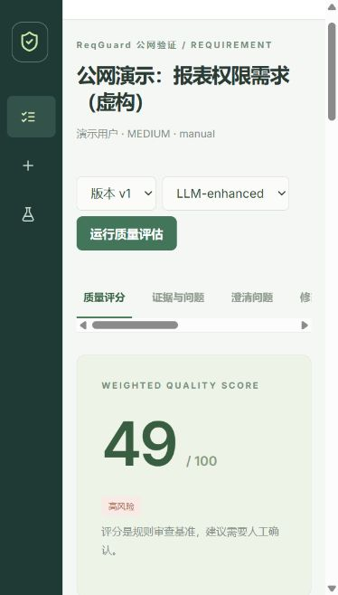
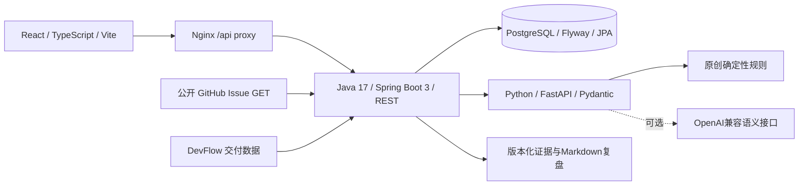
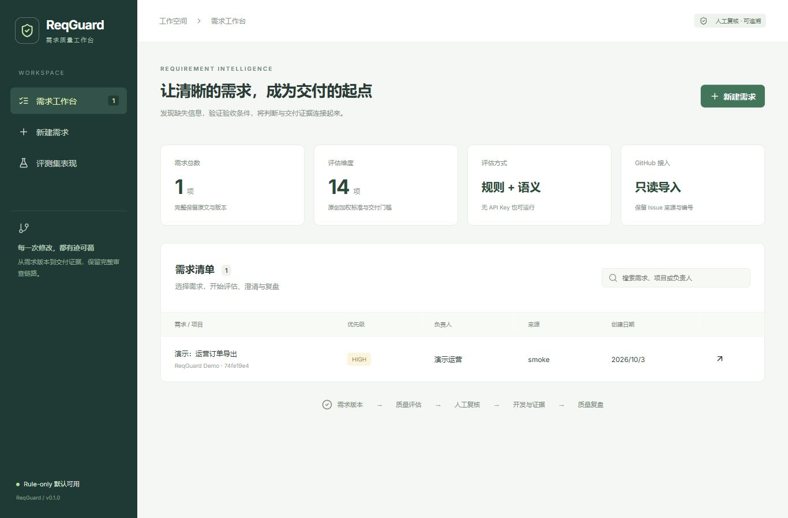

# ReqGuard

## 自动化质量保障专项 · v0.2.0

新增真实HTTP接口边界与并发版本测试、Playwright浏览器生命周期回归、Locust需求详情负载工具，新增GitHub Actions任务用于生成JUnit、浏览器trace和性能报告。运行方式、测试风险矩阵及结果解释见[质量保障专项](docs/quality-assurance.md)。14项接口测试、真实Chromium流程与性能冒烟已在[CI通过](https://github.com/xxu94420-commits/ReqGuard/actions/runs/37218238691)，JUnit、trace和压测报告已归档。仅在独立本地测试实例运行，不对公网演示压测。

**面向软件需求生命周期的质量评估与复盘 Agent**

原创、可运行的全栈 MVP：确定性质量标准与规则引擎、可选语义分析、版本追踪、人工反馈、交付证据和复盘。项目从空目录实现，没有复制其他完整项目。用于展示 AI Coding 研发效能中的可解释评估、质量闭环和工程交付。

## 在线演示：已部署公网

**ReqGuard 已部署至 Render，可通过 HTTPS 在公网访问，无需安装本地开发环境。**

- **演示地址**：[打开 ReqGuard 在线工作台](https://reqguard-demo.onrender.com/)
- **登录方式**：账号 `reqguard`；演示密码由项目作者向使用者单独提供，仓库不公开密码。
- **真实 AI**：已接入 Groq 的 `openai/gpt-oss-20b`；选择 `LLM-enhanced` 可运行规则与语义分析，供应商不可用时自动降级为规则模式。
- **部署实现**：Docker单容器、Nginx HTTPS代理、网页登录及安全会话、Java/Python内部服务隔离、GitHub Actions持续集成与Render自动部署。

### 使用者体验路径

1. 打开在线工作台并使用提供的演示凭据登录。
2. 新建一条虚构需求，例如“访客无需登录查看报表，但同一报表必须登录才能查看”。填写项目与负责人后保存。
3. 选择 `LLM-enhanced` 并运行评估，查看14维评分、规则/AI来源、原文证据与待确认问题。
4. 查看澄清问题、改写、验收与测试建议，接受或拒绝建议并记录理由。
5. 保存新版本，查看修改对比与不可覆盖的版本历史；填写交付证据并生成Markdown复盘。
6. 打开评测集表现，查看自建数据集的真实Precision、Recall、F1与误报漏报分析。

在线实例用于作品集演示，使用共享账号和临时H2数据库；休眠后首次访问需要冷启动，重启或重新部署会丢失数据，请使用虚构需求。已完成公网登录、需求创建、真实AI评估、证据与版本查看；完整生命周期另由本地smoke及CI验证。模型建议需要人工确认，连接成功不等同于准确率评测。



部署细节见[Render部署指南](docs/render-deployment.md)，测试及真实AI调用记录见[验证记录](docs/verification.md)。

## 解决什么问题

需求描述里的“尽快优化”无法直接变成验收；缺少角色、边界和依赖，容易把风险带到开发阶段。ReqGuard 将问题定位到文本证据，把建议作为待确认草稿，并将需求版本与任务、测试、缺陷和返工记录相连。没有 API Key 时核心链路仍然完整。

## 架构



Java 管理需求与追加式历史；Python 负责评估与 Schema 校验；前端呈现证据、复核和报告。生产配置用 PostgreSQL，本地无 Docker 可用 H2 开发配置。

## 质量标准

|维度|权重|维度|权重|
|---|---:|---|---:|
|背景完整度|5%|用户与使用场景|8%|
|目标明确度|9%|目标可衡量性|9%|
|功能范围|8%|非目标与边界|7%|
|验收标准|12%|可测试性|10%|
|数据依赖|5%|接口与系统依赖|5%|
|异常与错误处理|7%|风险说明|5%|
|优先级|4%|交付条件|6%|

各维度0–5分，总分为 `Σ(score × weight) / 5`，不是简单平均。验收或可测试性≤1时最高59分；检测到登录冲突最高49分。完整分层标准、例子和局限见 [质量标准](docs/quality-rubric.md)。

## 完整演示流程

1. 创建需求或导入公开 Issue，保存原文和 v1。
2. 运行 Rule-only 评估，查看分数、证据、缺口和置信度。
3. 查看澄清问题、改写建议、Given/When/Then 与三类测试模板。
4. 接受、拒绝（必须填原因）或修改建议，追加反馈记录。
5. 将人工确认后的文本保存为 v2，查看差异及历史；旧评估仍绑定旧版。
6. 创建开发计划，填写任务 ID、Commit、PR、测试、缺陷和返工数据。
7. 生成版本化 Markdown 复盘并下载，查看计划日期偏差与采纳率。
8. 查看自建评测集的真实识别表现，以及质量与交付指标的探索性关联。

前端包含需求列表、新建需求、质量评分、证据清单、澄清问题、修改对比、验收与测试、人工反馈、版本历史、质量复盘、评测集表现，共11个功能页面/视图。

## 快速启动：Docker

需要 Docker Engine/Desktop 和 Compose v2。复制 `.env.example` 为 `.env`（默认无密钥）。

```bash
git clone https://github.com/xxu94420-commits/ReqGuard.git
cd ReqGuard
docker compose up --build -d --wait
```

打开 http://localhost:3000 。数据库及 AI 服务不暴露宿主端口。数据库持久化在 `reqguard-data` volume。停止使用 `docker compose down`；`down -v` 会删除数据库，勿用于保留历史的环境。

```bash
docker compose logs -f backend ai
python scripts/smoke.py --base-url http://127.0.0.1:3000
```

smoke 会创建带“演示数据”标记的需求、两版历史、反馈与交付复盘；不会进行 GitHub 写操作。

## 本地开发

需要 Java 17+、Maven 3.9+、Python 3.11+、Node 24 与 pnpm 11.19。三个终端分别运行：

```bash
# 仓库根目录
python -m venv .venv
# Linux/macOS: source .venv/bin/activate
# Windows PowerShell: .\.venv\Scripts\Activate.ps1
pip install -e './ai-service[test]'
cd ai-service
uvicorn app.main:app --host 127.0.0.1 --port 8000
```

```bash
# 仓库根目录
mvn -f backend/pom.xml spring-boot:run
```

```bash
cd frontend
pnpm install --frozen-lockfile
pnpm dev
```

打开 http://localhost:5173 。Vite 将 `/api` 代理到 Java 8080。Python 文档位于 http://localhost:8000/docs 。本地 H2 文件在运行目录 `data/`；该目录不纳入 Git。外接 PostgreSQL 时设置 `DATABASE_URL=jdbc:postgresql://localhost:5432/reqguard`、`DATABASE_USER`、`DATABASE_PASSWORD`。

## 两种模式

默认选择 **Rule-only**：确定性证据、加权分数、澄清问题与待填验收/测试模板。

**LLM-enhanced**：在 AI 服务进程环境中配置 `LLM_API_KEY`、`LLM_BASE_URL`（含 `/v1`）、`LLM_MODEL`，页面选择增强模式。Compose 自动从 `.env` 注入。没有密钥、20秒超时、HTTP失败、无效 Schema 或证据不在原文中均降级 Rule-only。保存模型名、Prompt版本和耗时；不保存原始模型响应或密钥。语义结果不会改变规则基准分，必须人工复核。需确保供应商支持 Chat Completions JSON mode或严格JSON Schema；Groq配置见接入指南。

## 验证与评测

真实AI接入可在根目录`.env`填写供应商配置，AI服务会自动加载；服务端环境变量优先。运行`python scripts/check_llm.py`进行一次虚构需求连接验证，详见[真实AI接入指南](docs/ai-connection.md)。密钥不要提交Git。

```bash
cd ai-service
pytest -q
cd ..
ruff check ai-service scripts
ruff format --check ai-service scripts
python scripts/evaluate.py
mvn -B -ntp -f backend/pom.xml spotless:check verify
cd frontend
pnpm lint
pnpm format:check
pnpm test
pnpm build
```

自建36条样本：训练/开发24条、保留测试12条，12种需求情况。标签在规则预测之外逐条写入。**初始标签由 AI Coding 助手起草，尚未经过独立人工复核，因此不能称为人工金标准或外部泛化指标。** 标注者复核协议见 [标注指南](docs/annotation-guide.md)。未训练模型，未伪造LLM准确率。

|split|样本|Micro Precision|Micro Recall|Micro F1|
|---|---:|---:|---:|---:|
|train/dev|24|0.5143|0.8182|0.6316|
|test|12|0.4500|0.9000|0.6000|

结果由 `scripts/evaluate.py` 真实执行产生，完整 TP/FP/FN、错例和数据 SHA256 见 [结果文件](dataset/results.json)。评测揭示规则对“有验收标题但验收不可测”的漏报，以及全局数字被误当成目标指标的误判，不把低性能隐藏在总分里。

实际运行截图（演示数据）：



其他截图位于 [docs/screenshots](docs/screenshots/README.md)；验证记录见 [docs/verification.md](docs/verification.md)。GitHub Actions 分别验证 Python、Java、前端及 Docker/PostgreSQL 真实链路。

最新代码回归：Python 17项、Java 5项、前端2项测试通过；[六条CI流水线](https://github.com/xxu94420-commits/ReqGuard/actions/runs/37218238691)全部通过，包含Python、Java、前端、Docker、Render演示容器及自动化质量保障专项。完整记录见[验证记录](docs/verification.md)。

## 项目结构

```text
backend/         Spring Boot、JPA、Flyway、JUnit
ai-service/      FastAPI、规则、语义聚合、Pytest
frontend/        React 工作台、复核与复盘页面
dataset/         原创36条样本、split、标签与真实结果
scripts/         数据集生成、评测、端到端 smoke
docs/            架构、评分、标注、隐私、ADR、验证
.github/         持续集成及容器链路测试
compose.yaml     PostgreSQL + AI + Java + Web
```

## DevFlow 接口与限制

`GET /api/integrations/devflow/requirements/{id}?version=2` 输出质量特征；`POST /api/requirements/{id}/delivery` 接收交付特征；见 [交换模型与示例](docs/devflow-integration.md)。至少10条独立需求才计算 Pearson，零方差则显示不可计算；样本不足明确提示。相关性不代表因果，团队、复杂度等混杂变量尚未控制。当前实现协议接口，不会主动修改 DevFlow 或 GitHub。

本地Compose默认只暴露127.0.0.1，不带身份认证。Render演示版提供共享账号网页登录和安全会话，但未实现多用户权限隔离、业务级删除或自动GitHub证据验证。规则依赖中文线索，无法覆盖所有语义冲突，置信度是设计值而非概率校准。规则模式不生成已确认的具体业务指标。LLM处理可能将需求发送给配置的供应商，勿提交敏感需求。详见 [隐私与局限](docs/privacy-and-limitations.md)。

下一步：独立双人标注与分歧仲裁；按句子绑定证据；增加约束区间冲突；前端浏览器回归；租户认证与细粒度权限；只读交付证据校验与更大规模外部评测。版本记录见 [CHANGELOG](CHANGELOG.md)。
